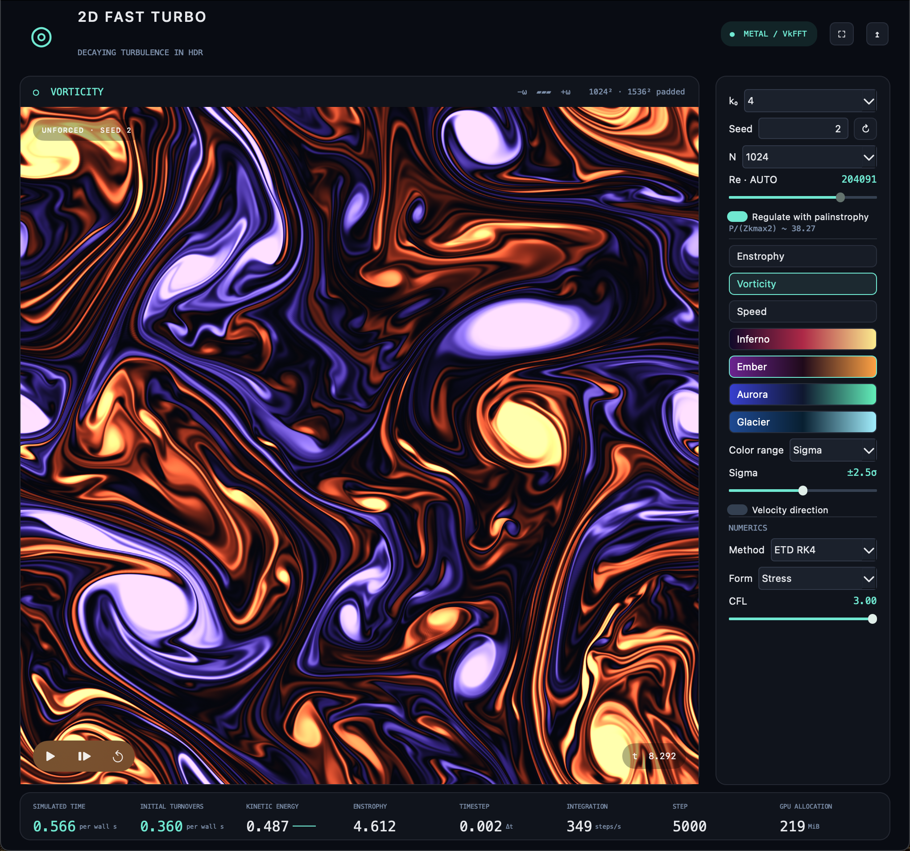

# FastTurbo media

Public screenshot for the FastTurbo Python package on PyPI.

Captured on Apple M1 Max after exactly 5,000 iterations, with a 1024 × 1024
simulation grid, a 1536 × 1536 padded workspace, and the native Metal / VkFFT
backend. The screenshot shows vorticity with the Ember palette.

Copyright (c) 2026 Torbjörn Sjögren. Licensed under the MIT license; see LICENSE.
